# Building Modern Applications with Next.js and MongoDB
Developers have more choices than ever before when it comes to choosing the technology stack for their next application. Developer productivity is one of the most important factors in choosing a modern stack and I believe that Next.js coupled with MongoDB can get you up and running on the next great application in no time at all. Let’s find out how and why!

If you would like to follow along with this tutorial, you can get the code from the [GitHub repo](https://github.com/kukicado/building-modern-app-with-nextjs-and-mongodb). Also, be sure to sign up for a [free MongoDB Atlas account](https://www.mongodb.com/download-center) to make it easier to connect your MongoDB database.

## What is Next.js
[Next.js](https://nextjs.org/) is a [React](https://reactjs.org/) based framework for building modern web applications. The framework comes with a lot of powerful features such as server side rendering, automatic code splitting, static exporting and much more that make it easy to build scalable and production ready apps. Its opinionated nature means that the framework is focused on developer productivity, but still flexible enough to give developers plenty of choice when it comes to handling the big architectural decisions.

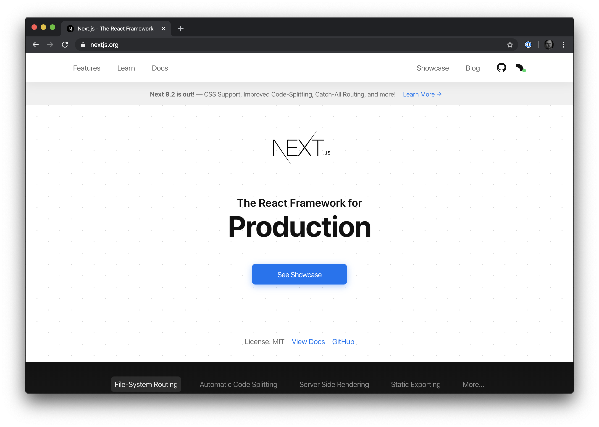

For this tutorial, I’ll assume that you are already familiar with React, and if so, you’ll be up and running with Next.js in no time at all. If you are not familiar with React, I would suggest looking at resources such as the [official React docs](https://reactjs.org/docs/getting-started.html) or taking a [free React starter course](https://scotch.io/starters/react/getting-started-with-react-2019-edition?ref=home-start-here) to get familiar with the framework first.

## What We’re Building: Macro Compliance Tracker
The app we’re building today is called the Macro Compliance Tracker. If you’re like me, you probably had a New Years Resolution of *“I’m going to get in better shape!”* This year, I am taking that resolution seriously, and have gotten a person trainer and nutritionist. One interesting thing that I learned is that while the old adage of calories in needs to be less than calories out to lose weight is generally true, your macronutrients also play just as an important role in weight loss. 

There are many great apps that help you track your calories and macros. Unfortunately, most apps do not allow you to track a range and another interesting thing that I learned in my fitness journey this year is that for many beginners trying to hit their daily macro goals is a challenge and many folks end up giving up when they fail to hit the exact targets consistently. For that reason, my coach suggests a target range for calories and macros rather than a hard set number.


So that’s what we’re building today. We’ll use Next.js to build our entire application and MongoDB as our database to store our progress. Let’s get into it!

## Setting up a Next.js Application
The easiest way to create a Next.js application is by using the official create-next-app npx command. To do that we’ll simply open up our Terminal window and type: `npx create-next-app mct`. “mct” is going to be the name of our application as well as the directory where our code is going to live. 

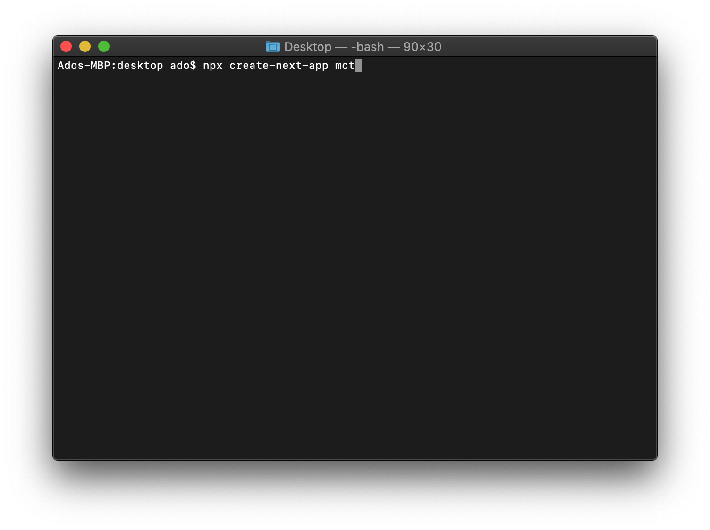

Execute this command and a default application will be created. Once the files are created navigate into the directory by running `cd mct` in the Terminal window and then execute `npm run dev`. This will start a development server for your Next.js application which you’ll be able to access at `localhost:3000`.

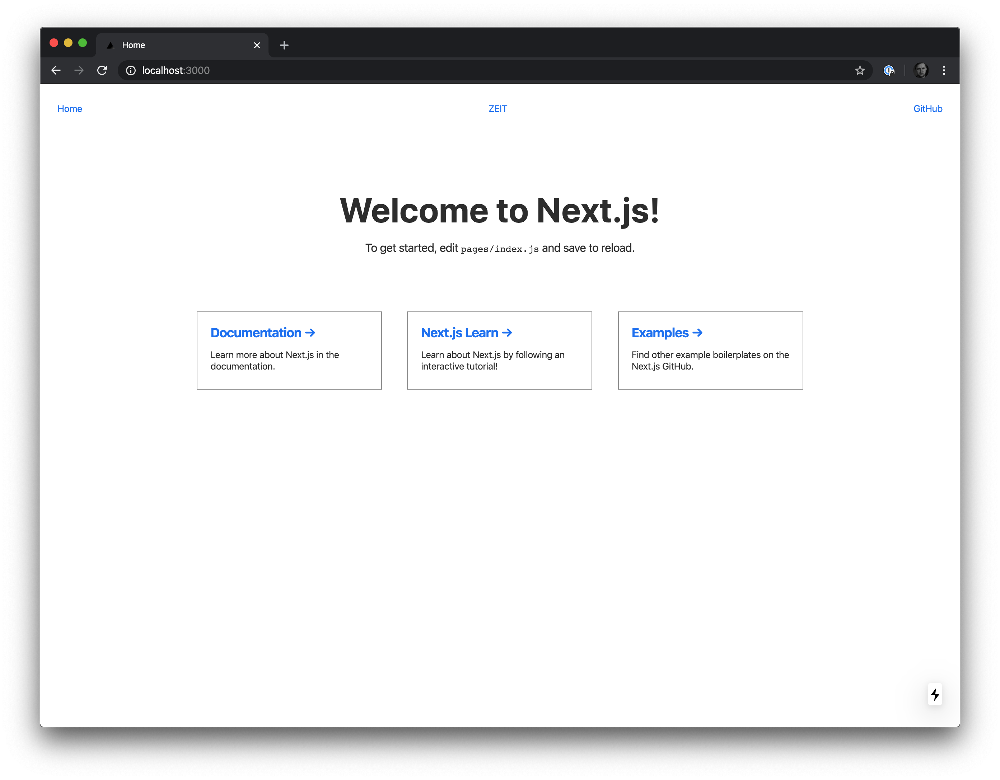

Navigate to `localhost:3000` and you should see a page very similar to the one in the above screenshot. If you see the Welcome to Next.js page you are good to go. If not, I would suggest following the Next.js docs and troubleshooting tips to ensure proper setup.

## Next.js Directory Structure
Before we dive into building our application any further, let’s quickly look at how Next.js structures our application. The default directory structure looks like this:

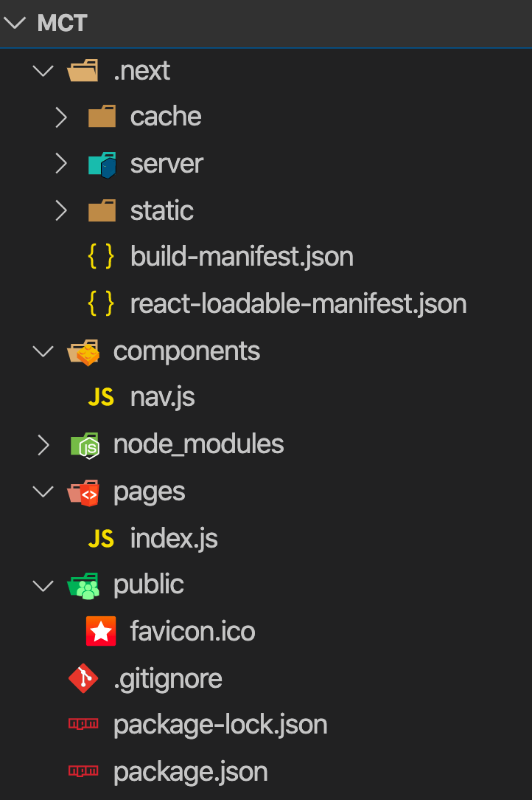

The areas we’re going to be focused on are the pages, components, and public directories. The .next directory contains the build artifacts for our application, and we should generally avoid making direct changes to it.

The pages directory will contain our application pages, or another way to think of these is that each file here will represent a single route in our application. Our default app only has the index.js page created which corresponds with our home route. If we wanted to add a second page, for example, an about page, we can easily do that by just creating a new file called about.js. The name we give to the filename will correspond to the route. So let’s go ahead and create an about.js file in the pages directory.

As I mentioned earlier, Next.js is a React based framework, so all your React knowledge is fully transferable here. You can create components using either as functions or as classes. I will be using the function based approach. Our About.js component will look like this:

```js
import React from 'react'
import Head from 'next/head'
import Nav from '../components/nav'

const About = () => (
  <div>
    <Head>
      <title>About</title>
      <link rel="icon" href="/favicon.ico" />
    </Head>

    <Nav />

    <div>
      <h1>Macro Compliance Tracker!</h1>
      <p>
        This app will help you ensure your macros are within a selected range to help you achieve your New Years Resolution!
      </p>
    </div>
  </div>
)

export default About
```

Go ahead and save this file. Next.js will automatically rebuild the application and you should be able to navigate to `http://localhost:3000/about` now and see your new component in action.

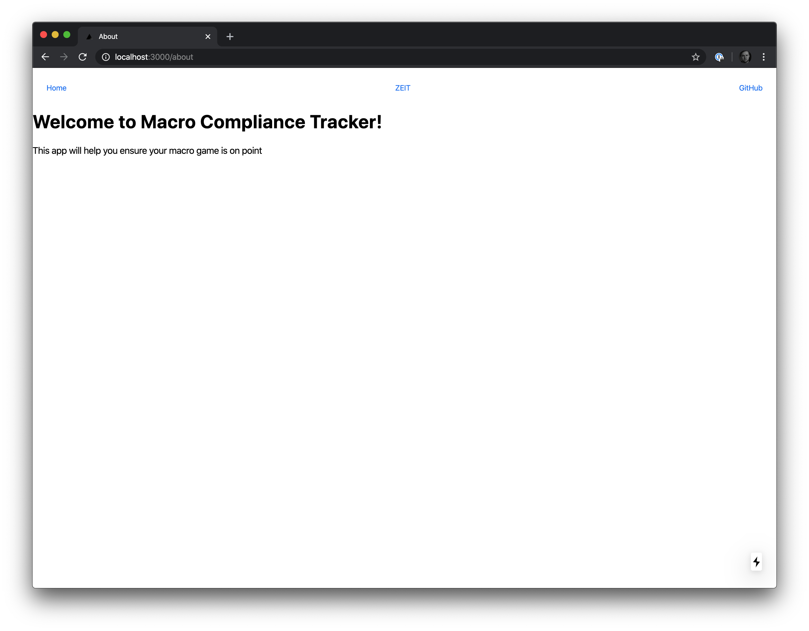


Next.js will automatically handle all the routing plumbing and ensure the right component gets loaded. Just remember, whatever you name your file in the pages directory is what the corresponding URL will be. 

## Adding Some Style with Tailwind.css
Our app is looking good, but from a design perspective, it’s looking pretty bare. Let’s add [Tailwind.css](https://tailwindcss.com/) to spruce up our design and make it a little easier on the eyes. Tailwind is a very powerful CSS framework, but for brevity we’ll just import the base styles from a CDN and won’t do any customizations. To do this, we’ll simply add `<link href="https://unpkg.com/tailwindcss@^1.0/dist/tailwind.min.css" rel="stylesheet"/>` in the Head components of our pages.

Let’s do this for our About component and also add some Tailwind classes to improve our design. Our next component should look like this:

```js
import React from 'react'
import Head from 'next/head'
import Nav from '../components/nav'

const About = () => (
  <div>
    <Head>
      <title>About</title>
      <link rel="icon" href="/favicon.ico" />
      <link href="https://unpkg.com/tailwindcss@^1.0/dist/tailwind.min.css" rel="stylesheet" />
    </Head>

    <Nav />

    <div className="container mx-auto text-center">
      <h1 className="text-6xl m-12">Macro Compliance Tracker!</h1>
      <p className="text-xl">
        This app will help you ensure your macros are within a selected range to help you achieve your New Years Resolution!
      </p>
    </div>
  </div>
)

export default About
```

If we go and refresh our browser, the About page should look like this:

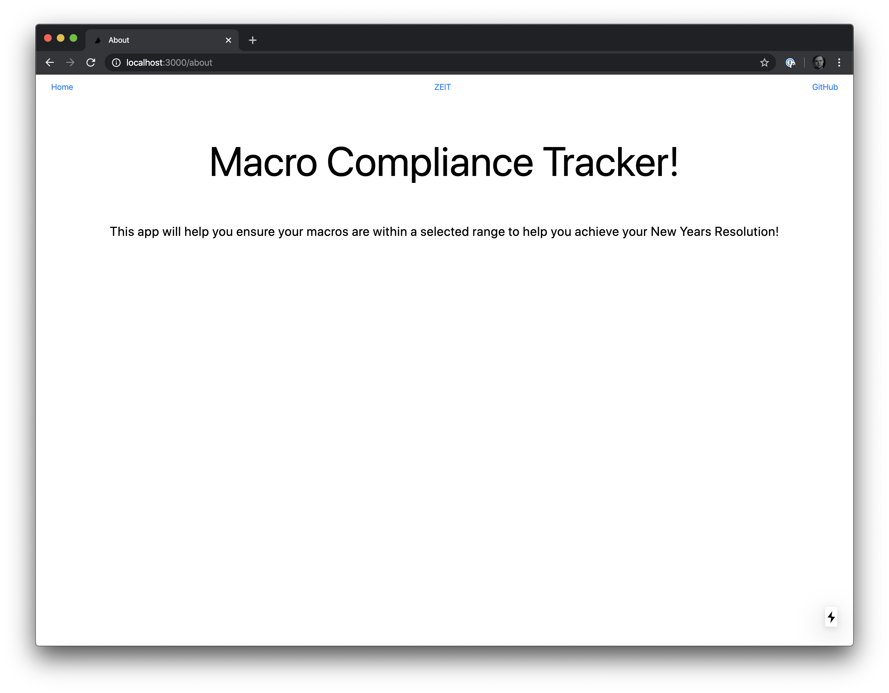

Good enough for now. If you want to learn more about Tailwind, check out their [official docs here](https://tailwindcss.com/docs/installation/).

Note: If when you make changes to your Next.js application such as adding the className’s or other changes, and they are not reflected when you refresh the page, restart the dev server.

## Creating Our Application
Now that we have our Next.js application setup, we’ve gone through and familiarized ourselves with how creating components and pages works, let’s get into building our Macro Compliance Tracker app. For our first implementation of this app, we’ll put all of our logic in the main index.js page. Open the page up and delete all the existing Next.js boilerplate.

Before we write the code, let’s figure out what features we’ll need. We’ll want to show the user their daily calorie and macro goals, as well as if they’re in compliance with their targeted range or not. Additionally, we’ll want to allow the user to update their information every day. Finally, we’ll want the user to be able to view previous days and see how they compare.
Let’s create the UI for this first. We’ll do it all in the Home component, and then start breaking it up into smaller individual components. Our code will look like this:

```js
import React from 'react'
import Head from 'next/head'
import Nav from '../components/nav'

const Home = () => (
  <div>
    <Head>
      <title>Home</title>
      <link rel="icon" href="/favicon.ico" />
      <link href="https://unpkg.com/tailwindcss@^1.0/dist/tailwind.min.css" rel="stylesheet" />
    </Head>

    <div className="container mx-auto">

      <div className="flex text-center">
        <div className="w-full m-4">
          <h1 className="text-4xl">Macro Compliance Tracker</h1>
        </div>
      </div>
      
      <div class="flex text-center">
        <div class="w-1/3 bg-gray-200 p-4">Previous Day</div>
        <div class="w-1/3 p-4">1/23/2020</div>
        <div class="w-1/3 bg-gray-200 p-4">Next Day</div>
      </div>

      <div class="flex mb-4 text-center">
        <div class="w-1/4 p-4 bg-green-500 text-white">
          <h2 className="text-3xl font-bold">1850
            <div class="flex text-sm p-4">
              <div class="w-1/3">1700</div>
              <div class="w-1/3 font-bold">1850</div>
              <div class="w-1/3">2000</div>
            </div>
          </h2>
          <h3 className="text-xl">Calories</h3>
        </div>
        <div class="w-1/4 p-4 bg-red-500 text-white">
          <h2 className="text-3xl font-bold">195
            <div class="flex text-sm p-4">
              <div class="w-1/3">150</div>
              <div class="w-1/3 font-bold">160</div>
              <div class="w-1/3">170</div>
            </div>
          </h2>
          <h3 className="text-xl">Carbs</h3>
        </div>
        <div class="w-1/4 p-4 bg-green-500 text-white">
          <h2 className="text-3xl font-bold">55
            <div class="flex text-sm p-4">
              <div class="w-1/3">50</div>
              <div class="w-1/3 font-bold">60</div>
              <div class="w-1/3">70</div>
            </div>
          </h2>
          <h3 className="text-xl">Fat</h3>
        </div>
        <div class="w-1/4 p-4 bg-blue-500 text-white">
          <h2 className="text-3xl font-bold">120
            <div class="flex text-sm p-4">
              <div class="w-1/3">145</div>
              <div class="w-1/3 font-bold">160</div>
              <div class="w-1/3">175</div>
            </div>
          </h2>
          <h3 className="text-xl">Protein</h3>
        </div>
      </div>

      <div className="flex">
        <div className="w-1/3">
          <h2 className="text-3xl p-4">Results</h2>
          <div className="p-4">
            <label className="block">Calories</label>
            <input type="number" className="bg-gray-200 text-gray-700 border rounded py-3 px-4 mb-3 leading-tight focus:outline-none focus:bg-white"></input>
          </div>
          <div className="p-4">
            <label className="block">Carbs</label>
            <input type="number" className="bg-gray-200 text-gray-700 border rounded py-3 px-4 mb-3 leading-tight focus:outline-none focus:bg-white"></input>
          </div>
          <div className="p-4">
            <label className="block">Fat</label>
            <input type="number" className="bg-gray-200 text-gray-700 border rounded py-3 px-4 mb-3 leading-tight focus:outline-none focus:bg-white"></input>
          </div>
          <div className="p-4">
            <label className="block">Protein</label>
            <input type="number" className="bg-gray-200 text-gray-700 border rounded py-3 px-4 mb-3 leading-tight focus:outline-none focus:bg-white"></input>
          </div>
          <div className="p-4">
            <button className="bg-blue-500 hover:bg-blue-700 text-white font-bold py-2 px-4 rounded">
              Save
            </button>
          </div>
        </div>
        <div className="w-1/3">
          <h2 className="text-3xl p-4">Target</h2>
          <div className="p-4">
            <label className="block">Calories</label>
            <input type="number" className="bg-gray-200 text-gray-700 border rounded py-3 px-4 mb-3 leading-tight focus:outline-none focus:bg-white"></input>
          </div>
          <div className="p-4">
            <label className="block">Carbs</label>
            <input type="number" className="bg-gray-200 text-gray-700 border rounded py-3 px-4 mb-3 leading-tight focus:outline-none focus:bg-white"></input>
          </div>
          <div className="p-4">
            <label className="block">Fat</label>
            <input type="number" className="bg-gray-200 text-gray-700 border rounded py-3 px-4 mb-3 leading-tight focus:outline-none focus:bg-white"></input>
          </div>
          <div className="p-4">
            <label className="block">Protein</label>
            <input type="number" className="bg-gray-200 text-gray-700 border rounded py-3 px-4 mb-3 leading-tight focus:outline-none focus:bg-white"></input>
          </div>
          <div className="p-4">
            <button className="bg-blue-500 hover:bg-blue-700 text-white font-bold py-2 px-4 rounded">
              Save
            </button>
          </div>
        </div>
        <div className="w-1/3">
          <h2 className="text-3xl p-4">Variance</h2>
          <div className="p-4">
            <label className="block">Calories</label>
            <input type="number" className="bg-gray-200 text-gray-700 border rounded py-3 px-4 mb-3 leading-tight focus:outline-none focus:bg-white"></input>
          </div>
          <div className="p-4">
            <label className="block">Carbs</label>
            <input type="number" className="bg-gray-200 text-gray-700 border rounded py-3 px-4 mb-3 leading-tight focus:outline-none focus:bg-white"></input>
          </div>
          <div className="p-4">
            <label className="block">Fat</label>
            <input type="number" className="bg-gray-200 text-gray-700 border rounded py-3 px-4 mb-3 leading-tight focus:outline-none focus:bg-white"></input>
          </div>
          <div className="p-4">
            <label className="block">Protein</label>
            <input type="number" className="bg-gray-200 text-gray-700 border rounded py-3 px-4 mb-3 leading-tight focus:outline-none focus:bg-white"></input>
          </div>
          <div className="p-4">
            <button className="bg-blue-500 hover:bg-blue-700 text-white font-bold py-2 px-4 rounded">
              Save
            </button>
          </div>
        </div>
      </div>
    </div>
  </div>
)

export default Home
```

And this will result in our UI looking like this:


There is a bit to unwind here. So let’s take a look at it piece by piece. At the very top we have a simple header that just displays the name of our application. Next, we have our day information and selection options. After that, we have our daily results showing whether we are in compliance or not for the selected day. If we are within the suggested range, the background is green. If we are over the range, meaning we’ve had too much of  a particular macro, the background is red, and if we under-consumed a particular macro, the background is blue. Finally, we have our form which allows us to update our daily results, our target calories and macros, as well as variance for our range.

Our code right now is all in one giant component and fairly static. Next let’s break up our giant component into smaller parts and add our front end functionality so we’re at least working with non-static data. We’ll create our components in the components directory and then import them into our index.js page component. Components we create in the components directory can be used across multiple pages with ease allowing us reusability if we add multiple pages to our application.

The first component that we’ll create is the result component. The result component is the green, red, or blue block that displays our result as well as our target and variance ranges. Our component will look like this:

```js
import React, {useState, useEffect} from 'react'
const Result = ({results}) => {
    let [bg, setBg] = useState("");
  
    useEffect(() => {
      setBackground()
    });
  
    const setBackground = () => {
      let min = results.target - results.variant;
      let max = results.target + results.variant;
  
      if(results.total >= min && results.total <= max) {
        setBg("bg-green-500");
      } else if ( results.total < min){
        setBg("bg-blue-500");
      } else {
        setBg("bg-red-500")
      }
    }
    
    return (
      <div className={bg + " w-1/4 p-4 text-white"}>
        <h2 className="text-3xl font-bold">{results.total}
          <div className="flex text-sm p-4">
            <div className="w-1/3">{results.target - results.variant}</div>
            <div className="w-1/3 font-bold">{results.target}</div>
            <div className="w-1/3">{results.target + results.variant}</div>
          </div>
        </h2>
        <h3 className="text-xl">{results.label}</h3>
      </div>
    )
  }

export default Result
```

This will allow us to feed this component dynamic data and based on the data provided, we’ll display the correct background, as well as target ranges for our macros. We can now simplify our index.js page component by removing all the boilerplate code and replacing it with:

```js
<div className="flex mb-4 text-center">
        <Result results={results.calories} />
        <Result results={results.carbs} />
        <Result results={results.fat} />
        <Result results={results.protein} />
      </div>
```

Let’s also go ahead and create some dummy data for now. We’ll get to retrieving live data from MongoDB soon, but for now let’s just create some data in-memory like so:

```js
const Home = () => {
  let data = {
    calories: {
      label: "Calories",
      total: 1840,
      target: 1840,
      variant: 15
    },
    carbs: {
      label: "Carbs",
      total: 190,
      target: 160,
      variant: 15
    },
    fat: {
      label: "Fat",
      total: 55,
      target: 60,
      variant: 10
    },
    protein: {
      label: "Protein",
      total: 120,
      target: 165,
      variant: 10
    }
  }
  
  const [results, setResults] = useState(data);

  return ( … )}
```

If we look at our app now, it won’t look very different at all. And that’s ok. All we’ve done so far is change how our UI is rendered, moving it from hard coded static values, to an in-memory object. Next let’s go ahead and make our form work with this in-memory data. Since our forms are very similar, we can create a component here as well and re-use the same component.

We will create a new component called MCTForm and in this component we’ll pass in our data, a name for the form, and an onChange handler that will update the data dynamically as we change the values in the input boxes. Also, for simplicity, we’ll remove the Save button and move it outside of the form. This will allow the user to make changes to their data in the UI, and when the user wants to lock in the changes and save them to the database, then they’ll hit the Save button. So our Home component will now look like this:

```js
const Home = () => {
  let data = {
    calories: {
      label: "Calories",
      total: 1840,
      target: 1850,
      variant: 150
    },
    carbs: {
      label: "Carbs",
      total: 190,
      target: 160,
      variant: 15
    },
    fat: {
      label: "Fat",
      total: 55,
      target: 60,
      variant: 10
    },
    protein: {
      label: "Protein",
      total: 120,
      target: 165,
      variant: 10
    }
  }
  
  const [results, setResults] = useState(data);

  const onChange = (e) => {
    const data = { ...results };

    let name = e.target.name;

    let resultType = name.split(" ")[0].toLowerCase();
    let resultMacro = name.split(" ")[1].toLowerCase();

    data[resultMacro][resultType] = e.target.value;

    setResults(data);
  }

  return (
  <div>
    <Head>
      <title>Home</title>
      <link rel="icon" href="/favicon.ico" />
      <link href="https://unpkg.com/tailwindcss@^1.0/dist/tailwind.min.css" rel="stylesheet" />
    </Head>

    <div className="container mx-auto">

      <div className="flex text-center">
        <div className="w-full m-4">
          <h1 className="text-4xl">Macro Compliance Tracker</h1>
        </div>
      </div>
      
      <div className="flex text-center">
        <div className="w-1/3 bg-gray-200 p-4">Previous Day</div>
        <div className="w-1/3 p-4">1/23/2020</div>
        <div className="w-1/3 bg-gray-200 p-4">Next Day</div>
      </div>

      <div className="flex mb-4 text-center">
        <Result results={results.calories} />
        <Result results={results.carbs} />
        <Result results={results.fat} />
        <Result results={results.protein} />
      </div>

      <div className="flex">
        <MCTForm data={results} item="Total" onChange={onChange} />
        <MCTForm data={results} item="Target" onChange={onChange} />
        <MCTForm data={results} item="Variant" onChange={onChange} />
      </div>

      <div className="flex text-center">
        <div className="w-full m-4">
          <button className="bg-blue-500 hover:bg-blue-700 text-white font-bold py-2 px-4 rounded">
              Save
          </button>
        </div>
      </div>
    </div>
  </div>
)}

export default Home
```

Aside from cleaning up the UI code, we also added an onChange function that will be called every time the value of one of the input boxes changes. The onChange function will determine which box was changed and update the data value accordingly as well as re-render the UI to show the new changes. 

Next, let’s take a look at our implementation of the MCTForm component.

```js
import React from 'react'

const MCTForm = ({data, item, onChange}) => {
  return(
    <div className="w-1/3">
      <h2 className="text-3xl p-4">{item}</h2>
      <div className="p-4">
        <label className="block">Calories</label>
        <input type="number" name={item + " Calories"} className="bg-gray-200 text-gray-700 border rounded py-3 px-4 mb-3 leading-tight focus:outline-none focus:bg-white" onChange={(e) => onChange(e)}></input>
      </div>
      <div className="p-4">
        <label className="block">Carbs</label>
        <input type="number" name={item + " Carbs"} className="bg-gray-200 text-gray-700 border rounded py-3 px-4 mb-3 leading-tight focus:outline-none focus:bg-white" onChange={(e) => onChange(e)}></input>
      </div>
      <div className="p-4">
        <label className="block">Fat</label>
        <input type="number" name={item + " Fat"} className="bg-gray-200 text-gray-700 border rounded py-3 px-4 mb-3 leading-tight focus:outline-none focus:bg-white" onChange={(e) => onChange(e)}></input>
      </div>
      <div className="p-4">
        <label className="block">Protein</label>
        <input type="number" name={item + " Protein"} className="bg-gray-200 text-gray-700 border rounded py-3 px-4 mb-3 leading-tight focus:outline-none focus:bg-white" onChange={(e) => onChange(e)}></input>
      </div>
    </div>
  )
}

export default MCTForm
```

As you can see this component is in charge of rendering our forms. Since the input boxes are the same for all three types of forms, we can reuse the component multiple times and just change the type of data we are working with.

Again if we look at our application in the browser now, it doesn’t look much different. But now the form works. We can replace the values and the application will be dynamically updated showing our new total calories and macros and whether or not we are in compliance with our goals. Go ahead and play around with it for a little bit to make sure it all works.

## Connecting Our Application to MongoDB
Our application is looking good. It also works. But, the data is all in memory. As soon as we refresh our page, all the data is reset to the default values. In this sense, our app is not very useful. So our next step will be to connect our application to a database so that we can start seeing our progress over time. We’ll use MongoDB and [MongoDB Atlas](https://www.mongodb.com/cloud/atlas) to accomplish this. 

## Setting Up Our MongoDB Database
Before we can save our data, we’ll need a database. For this I’ll use MongoDB and MongoDB Atlas to host my database. If you don’t already have MongoDB Atlas, you can sign up and use it for [free here](https://www.mongodb.com/download-center), otherwise go into an existing cluster and create a new database. Inside MongoDB Atlas, I will use an existing cluster and set up a new database called MCT. With this new database created, I will create a new collection called daily that will store my daily results, target macros, as well as allowed variants. 

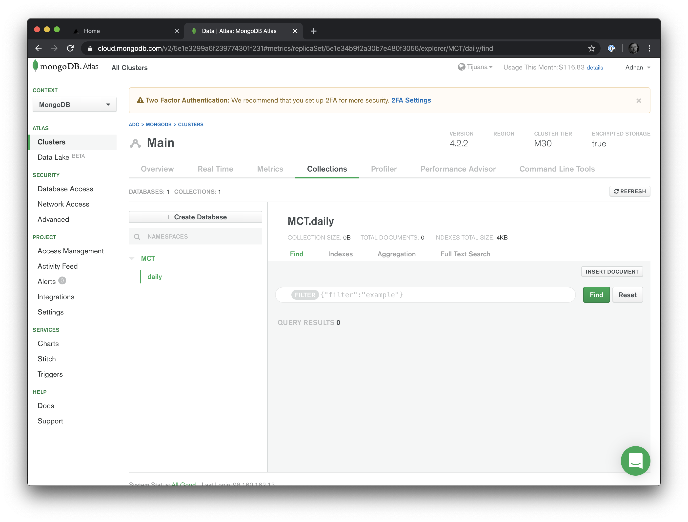

With my database set up, I will also add a few days worth of data. Feel free to add your own data or if you’d like the dataset I’m using, you can get it here. I will use [MongoDB Compass](https://www.mongodb.com/download-center/compass) to import and view the data, but you can import the data however you want: use the CLI, add in manually, or use Compass.

Thanks to MongoDB’s document model, I can represent the data exactly as I had it in-memory. The only additional fields I will have in my MongoDB model is an _id field that will be a unique identifier for the document and a date field that will represent the data for a specific date. The image below shows the data model for one document in MongoDB Compass.

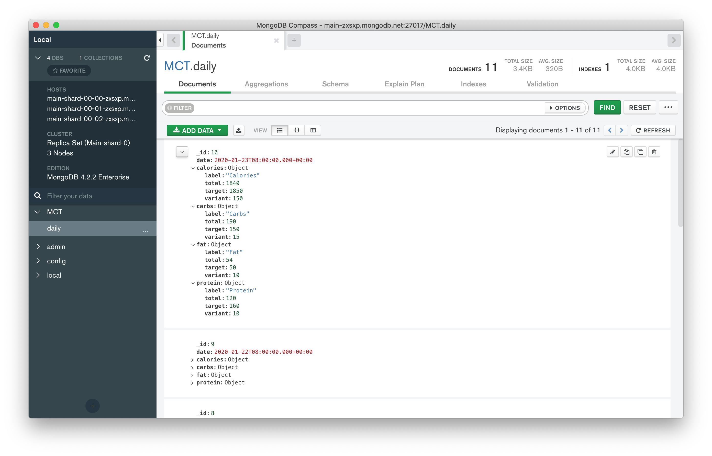

Now that we have some real data to work with, let’s go ahead and connect our Next.js application to our MongoDB Database. Since Next.js is a React based framework that’s running Node server-side we will use the excellent Mongo Node Driver to facilitate this connection. 

## Connecting Next.js to MongoDB Atlas

Our pages and components directory renders both server-side on the initial load as well as client-side on subsequent page changes. The MongoDB Node Driver works only on the server side and assumes we’re working on the backend. Not to mention that our credentials to MongoDB need to be secure and not shared to the client ever.

Not to worry though, this is where Next.js shines. In the pages directory, we can create an additional special directory called api. In this API directory, as the name implies, we can create api endpoints that are executed exclusively on the backend. The best way to see how this works is to go and create one, so let’s do that next. In the pages directory, create an api directory, and there create a new file called daily.js. 

In the daily.js file, add the following code:

```js
export default (req, res) => {
    res.statusCode = 200
    res.setHeader('Content-Type', 'application/json')
    res.end(JSON.stringify({ message: 'Hello from the Daily route' }))
  }
```
Save the file, go to your browser and navigate to `localhost:3000/api/daily`. What you’ll see is the JSON response of `{message:’Hello from the Daily route’}`. This code is only ever run server side and the only thing the browser receives is the response we send. This seems like the perfect place to set up our connection to MongoDB.

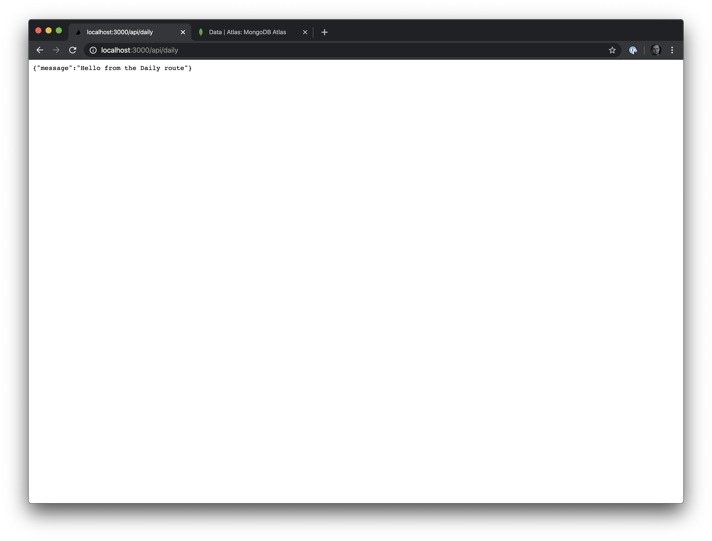

While we can set the connection in this daily.js file, in a real world application, we are likely to have multiple API endpoints and for that reason, it’s probably a better idea to establish our connection to the database in a middleware function that we can pass to all of our api routes. So as a best practice, let’s do that here.

Create a new middleware directory at the root of the project structure alongside pages and components and call it middleware. The middleware name is not reserved so you could technically call it whatever you want, but I’ll stick to middleware for the name. In this new directory create a file called database.js. This is where we will set up our connection to MongoDB as well as instantiate the middleware so we can use it in our API routes.

Our database.js middleware code will look like this:

```js
import { MongoClient } from 'mongodb';
import nextConnect from 'next-connect';

const client = new MongoClient('{YOUR-MONGODB-CONNECTION-STRING}', {
  useNewUrlParser: true,
  useUnifiedTopology: true,
});

async function database(req, res, next) {
  if (!client.isConnected()) await client.connect();
  req.dbClient = client;
  req.db = client.db('MCT');
  return next();
}

const middleware = nextConnect();

middleware.use(database);

export default middleware;
```

If you are following along, be sure to replace the `{YOUR-MONGODB-CONNECTION-STRING}` variable with your connection string, as well as ensure that the client.db matches the name you gave your database. Also be sure to run `npm install --save mongodb next-connect` to ensure you have all the correct dependencies. Database names are case sensitive by the way. Save this file and now open up the daily.js file located in the pages/api directory.

We will have to update this file. Since now we want to add a piece of middleware to our function, we will no longer be using an anonymous function here. We’ll utility next-connect to give us a handler chain as well as allow us to chain middleware to the function. Let’s take a look at what this will look like.

```js
import nextConnect from 'next-connect';
import middleware from '../../middleware/database';

const handler = nextConnect();

handler.use(middleware);

handler.get(async (req, res) => {

    let doc = await req.db.collection('daily').findOne()
    console.log(doc);
    res.json(doc);
});

export default handler;
```

As you can see we now have a handler object that gives us much more flexibility. We can use different HTTP verbs, add our middleware, and more. What the code above does, is that it connects to our MongoDB Atlas cluster and from the MCT database and daily collection, finds and returns one item and then renders it to the screen. If we hit `localhost:3000/api/daily` now in our browser we’ll see this:

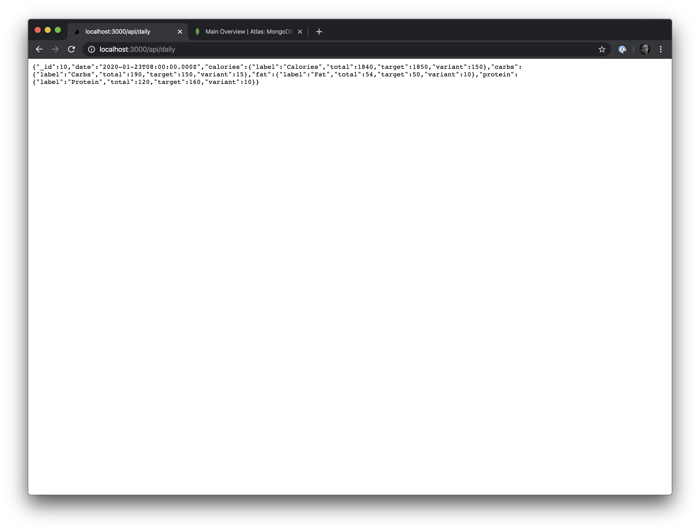

Woohoo! We have our data and the data model matches our in-memory data model, so our next step will be to use this real data instead of our in-memory sample. To do that, we’ll open up the index.js page.

Our main component is currently instantiated with an in-memory data model that the rest of our app acts upon. Let’s change this. Next.js gives us a couple of different ways to do this. We can always get the data async from our React component, and if you’ve used React in the past this should be second nature, but since we’re using Next.js I think there is a different and perhaps better way to do it.

Each Next.js page component allows us to fetch data server-side thanks to a function called getInitialProps. When this function is called, the initial page load is rendered server-side, which is great for SEO. The page doesn’t render until this function completes. For subsequent loads though, the getInitialProps method can execute client side, thus giving us the best of both worlds. Let’s see how we’ll implement this in our application. In index.js, we’ll make the following changes:

```js
import fetch from 'isomorphic-unfetch'
const Home = ({data}) => { … }

Home.getInitialProps = async () => {
  const res = await fetch('http://localhost:3000/api/daily')
  const json = await res.json()
  return { data: json }
}

export default Home
```

Install the isomorphic-unfetch library by running `npm install --save isomorphic-unfetch`, then below your Home component add the getInitialProps method. In this method we’re just making a fetch call to our daily API endpoint and storing that json data in a prop called data. Since we created a data prop, we then pass it into our Home component, and at this point, we can go and remove our in-memory data variable. Do that, save the file, and refresh your browser.

Congrats! Your data is now coming live from MongoDB. But at the moment, it’s only giving us one result. Let’s make a few final tweaks so that we can see daily results, as well as update the data and save it in the database.

## View Macro Compliance Tracker Data By Day

The first thing we’ll do is add the ability to hit the Previous Day and Next Day buttons and display the corresponding data. We won’t be creating a new endpoint since I think our daily API endpoint can do the job, we’ll just have to make a few enhancements. Let’s do those first. Our new daily.js API file will look as such:

```js
handler.get(async (req, res) => {
    const { date } = req.query;

    const dataModel = { "_id": new ObjectID(), "date": date, "calories": { "label": "Calories", "total": 0, "target": 0, "variant": 0 }, "carbs": { "label": "Carbs", "total": 0, "target": 0, "variant": 0 }, "fat": { "label" : "Fat", "total": 0, "target": 0, "variant": 0 }, "protein": { "label" : "Protein", "total": 0, "target": 0, "variant": 0 }}

    let doc = {}

    if(date){
        doc = await req.db.collection('daily').findOne({date: new Date(date)})
    } else {
        doc = await req.db.collection('daily').findOne()
    }
    if(doc == null){
        doc = dataModel
    }
    res.json(doc)
});
```

We made a couple of changes here so let’s go through them one by one. The first thing we did was we are looking for a date query parameter to see if one was passed to us. If a date parameter was not passed, then we’ll just pick a random item using the findOne method. But, if we did receive a date, then we’ll query our MongoDB database against that date and return the data for that specified date.

Next, as our data set is not exhaustive, if we go too far forwards or backwards, we’ll eventually run out of data to display, so we’ll create an empty in-memory object that serves as our data model. If we don’t have data for a specified date in our database, we’ll just set everything to 0 and serve that. This way we don’t have to do a whole lot of error handling on the front and can always count on our backend to serve some type of data. 

Now, open up the index.js page and let’s add the functionality to see the previous and next days. We’ll make use of dayjs to handle our dates, so install it by running `npm install --save dayjs` first. Then make the following changes to your index.js page:

```js
// Other Imports ...
import dayjs from 'dayjs'

const Home = ({data}) => {
  const [results, setResults] = useState(data);

  const onChange = (e) => {
    ...
  }

  const getDataForPreviousDay = async () => {
    let currentDate = dayjs(results.date);
    let newDate = currentDate.subtract(1, 'day').format('YYYY-MM-DDTHH:mm:ss')
    const res = await fetch('http://localhost:3000/api/daily?date=' + newDate)
    const json = await res.json()
    
    setResults(json);
  }

  const getDataForNextDay = async () => {
    let currentDate = dayjs(results.date);
    let newDate = currentDate.add(1, 'day').format('YYYY-MM-DDTHH:mm:ss')
    const res = await fetch('http://localhost:3000/api/daily?date=' + newDate)
    const json = await res.json()
    
    setResults(json);
  }

return (
         ...
      
      <div className="flex text-center">
        <div className="w-1/3 bg-gray-200 p-4"><button onClick={getDataForPreviousDay}>Previous Day</button></div>
        <div className="w-1/3 p-4">{dayjs(results.date).format('MM/DD/YYYY')}</div>
        <div className="w-1/3 bg-gray-200 p-4"><button onClick={getDataForNextDay}>Next Day</button></div>
      </div>

      ...
)}
```

We added two new methods, one to get the data from the previous day and one to get the data from the following day. In our UI we also made the date label dynamic so that it displays and tells us what day we are currently looking at. With these changes go ahead and refresh your browser and you should be able to see the new data for days you have entered in your database. If a particular date does not exist, it will show 0’s for everything.

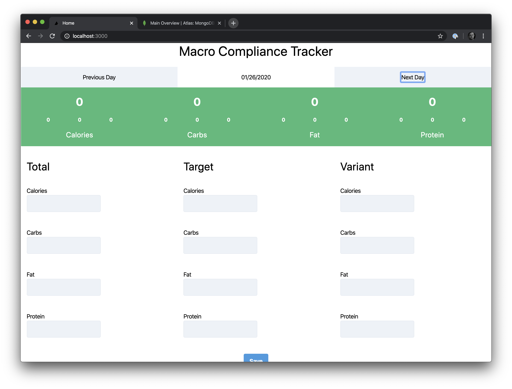


## Saving and Updating Data In MongoDB
Finally, let’s close out this tutorial by adding the final piece of functionality to our app, which will be to make updates and save new data into our MongoDB database. Again, I don’t think we need a new endpoint for this, so we’ll use our existing daily.js API. Since we’re using the handler convention and currently just handle the GET verb, let’s add onto it by adding logic to handle a POST to the endpoint. 

```js
handler.post(async (req, res) => {
    let data = req.body
    data = JSON.parse(data);
    data.date = new Date(data.date);
    let doc = await req.db.collection('daily').updateOne({date: new Date(data.date)}, {$set:data}, {upsert: true})

    res.json({message: 'ok'});
})
```

The code is pretty straightforward. We’ll get our data in the body of the request, parse it, and then save it to our MongoDB daily collection using the updateOne() method. Let’s take a closer look at the values we’re passing into the updateOne() method.

The first value we pass will be what we match against, so in our collection if we find that the specific date already has data, we’ll update it. The second value will be the data we are setting and in our case, we’re just going to set whatever the front-end client sends us. Finally, we are setting the upsert value to true. What this will do is, if we cannot match on an existing date, meaning we don’t have data for that date already, we’ll go ahead and create a new record.

With our backend implementation complete, let’s add the functionality on our front end so that when the user hits the Save button, the data gets properly updated. Open up the index.js file and make the following changes:

```js
const Home = ({data}) => {
 ...

  const updateMacros = async () => {
    const res = await fetch('http://localhost:3000/api/daily', {
      method: 'post',
      body: JSON.stringify(results)
    })
  }

  return (
       ….

      <div className="flex text-center">
        <div className="w-full m-4">
          <button className="bg-blue-500 hover:bg-blue-700 text-white font-bold py-2 px-4 rounded" onClick={updateMacros}>
              Save
          </button>
        </div>
      </div>
)}
```

Our new updateMacros method will make a POST request to our daily API endpoint with the new data. Try it now! You should be able to update existing macros or create data for new days that you don’t already have any data for. We did it!

## Putting It All Together
We went through a lot in today’s tutorial. Next.js is a powerful framework for building modern web applications and having a flexible database powered by MongoDB made it possible to build a fully fledged application in no time at all. There were a couple of items we omitted for brevity such as error handling and deployment, but feel free to [clone the application from GitHub](https://github.com/kukicado/building-modern-app-with-nextjs-and-mongodb), [sign up for MongoDB Atlas for free](https://www.mongodb.com/download-center), and build on top of this foundation.
